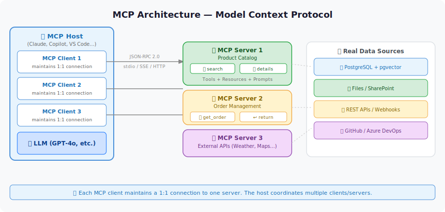

# 🔌 Parcours Model Context Protocol (MCP)

L100 L200 L300

Model Context Protocol (MCP) est un **standard ouvert** créé par Anthropic qui offre aux agents IA un moyen unifié et cohérent de se connecter à des outils externes, des APIs et des sources de données.

Considérez-le comme « l'USB-C pour les agents IA » — une interface standard pour que n'importe quel agent puisse se connecter à n'importe quel outil.

---

## Ce que Vous Allez Construire

À la fin de ce parcours, vous aurez :

- ✅ Une compréhension approfondie du fonctionnement de MCP (protocole, transports, outils vs. ressources vs. prompts)
- ✅ De l'expérience dans la consommation de serveurs MCP existants depuis Claude Desktop et VS Code
- ✅ Construit votre propre serveur MCP en **Python** et/ou **C#**
- ✅ Connecté un serveur MCP à un **Agent Microsoft Foundry**
- ✅ Exposé une **base de données PostgreSQL** de manière sécurisée via un serveur MCP

---

## Laboratoires du Parcours (4 laboratoires, ~170 min au total)

| Lab | Titre | Niveau | Coût |
|-----|-------|--------|------|
| [Lab 012](../../labs/lab-012-what-is-mcp.md) | Qu'est-ce que MCP ? Anatomie du Protocole | L100 | ✅ Free |
| [Lab 020](../../labs/lab-020-mcp-server-python.md) | Construire un Serveur MCP en Python | L200 | ✅ Free |
| [Lab 021](../../labs/lab-021-mcp-server-csharp.md) | Construire un Serveur MCP en C# | L200 | ✅ Free |
| [Lab 028](../../labs/lab-028-deploy-mcp-azure.md) | Déployer un Serveur MCP sur Azure Container Apps | L300 | Free |

---

## Concepts Clés

### Architecture MCP

### Trois primitives dans MCP

| Primitive | Description | Exemple |
|-----------|-------------|---------|
| **Tools** | Fonctions que le LLM peut appeler | `search_products(query)` |
| **Resources** | Données que le LLM peut lire | `file://data/products.csv` |
| **Prompts** | Modèles de prompts réutilisables | `summarize_sales_report` |

---

## Ressources Externes

- [Documentation Officielle MCP](https://modelcontextprotocol.io)
- [MCP pour Débutants (Microsoft)](https://github.com/microsoft/mcp-for-beginners)
- [Serveur MCP Azure](https://learn.microsoft.com/azure/developer/azure-mcp-server/)
- [MCP Inspector (outil de débogage)](https://github.com/modelcontextprotocol/inspector)
