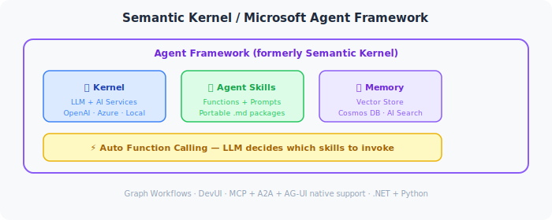

# 🧠 Parcours Semantic Kernel

L100 L200 L300 L400

Semantic Kernel (SK) est le SDK open-source de Microsoft pour construire des agents et applications IA en **Python**, **C#** et **Java**. Il fournit une riche couche d'abstraction sur les LLMs avec le support des plugins, de la mémoire, des magasins vectoriels, de l'appel automatique de fonctions et de l'orchestration multi-agent.

---

## Ce que Vous Allez Construire

- ✅ Votre premier agent SK avec **GitHub Models (gratuit)**
- ✅ Des **Plugins** (fonctions natives + connecteurs OpenAPI)
- ✅ De la **mémoire vectorielle** pour des agents contextuels
- ✅ L'**appel automatique de fonctions** avec des planificateurs
- ✅ L'**orchestration multi-agent** avec un patron orchestrateur + travailleur

---

## Laboratoires du Parcours (3 laboratoires, ~135 min au total)

| Lab | Titre | Niveau | Coût |
|-----|-------|--------|------|
| [Lab 014](../../labs/lab-014-sk-hello-agent.md) | Semantic Kernel — Bonjour Agent | L100 | ✅ GitHub Free |
| [Lab 023](../../labs/lab-023-sk-plugins-memory.md) | Semantic Kernel — Plugins, Mémoire et Planificateurs | L200 | ✅ GitHub Free |
| [Lab 034](../../labs/lab-034-multi-agent-sk.md) | Orchestration Multi-Agent avec Semantic Kernel | L300 | ✅ GitHub Free |

---

## Blocs de Construction de Semantic Kernel

---

## Ressources Externes

- [Semantic Kernel GitHub](https://github.com/microsoft/semantic-kernel)
- [Documentation SK](https://learn.microsoft.com/semantic-kernel/)
- [SK Cookbook (Python)](https://github.com/microsoft/semantic-kernel/tree/main/python/samples)
- [SK Cookbook (C#)](https://github.com/microsoft/semantic-kernel/tree/main/dotnet/samples)
