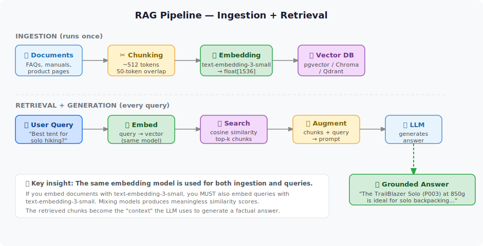

# 📚 Trilha RAG

L100 L200 L300 L400

**Retrieval-Augmented Generation (RAG)** é o padrão mais comum para fundamentar agentes de IA nos seus próprios dados. Em vez de depender dos dados de treinamento do LLM, você recupera documentos relevantes no momento da consulta e os inclui no prompt.

---

## O que Você Vai Construir

- ✅ Compreender o pipeline RAG de ponta a ponta
- ✅ Carregar, fragmentar e gerar embeddings de documentos usando **GitHub Models (gratuito)**
- ✅ Armazenar e consultar vetores com um **pgvector local** (Docker)
- ✅ Construir busca semântica sobre **Azure PostgreSQL + pgvector**
- ✅ Avaliar a qualidade do RAG com o Azure AI Evaluation SDK

---

## Laboratórios da Trilha (7 laboratórios, ~355 min no total)

| Lab | Título | Nível | Custo |
|-----|--------|-------|-------|
| [Lab 006](../../labs/lab-006-what-is-rag.md) | O que é RAG? | L50 | ✅ Free |
| [Lab 007](../../labs/lab-007-what-are-embeddings.md) | O que são Embeddings? | L50 | ✅ Free |
| [Lab 022](../../labs/lab-022-rag-github-models-pgvector.md) | Pipeline RAG com GitHub Models + pgvector | L200 | ✅ Free |
| [Lab 026](../../labs/lab-026-agentic-rag.md) | Padrão RAG Agêntico | L200 | ✅ GitHub Free |
| [Lab 031](../../labs/lab-031-pgvector-semantic-search.md) | Busca Semântica com pgvector no Azure | L300 | Free |
| [Lab 039](../../labs/lab-039-vector-db-comparison.md) | Comparação de Bancos de Dados Vetoriais | L300 | ✅ Free |
| [Lab 042](../../labs/lab-042-enterprise-rag.md) | RAG Empresarial com Avaliações | L400 | ⚠️ Azure |

---

## O Pipeline RAG

---

## Recursos Externos

- [pgvector GitHub](https://github.com/pgvector/pgvector)
- [Azure AI Search + RAG](https://learn.microsoft.com/azure/search/retrieval-augmented-generation-overview)
- [API de Embeddings do GitHub Models](https://docs.github.com/en/github-models)
- [Azure AI Evaluation SDK](https://learn.microsoft.com/azure/ai-foundry/how-to/develop/agent-evaluate-sdk)
